# Sanity Agent — Operational Playbook

This is the single-source guide to running, extending, and reasoning about the
sanity agent. Read top-to-bottom. Every section has a "where in the code" pointer.

> **Status (2026-06-26):** **8/8 critical flows green across 4 sites, all 4
> sites status `passed`** — pizzahut-malaysia, sephora-india, shop-nexus-one,
> **nykaa-india (added in ~25 min via 4 escalation iterations, see §6 case
> study)**, 217s end-to-end. Latest report:
> `reports/run-1782451200876/report.html`. **126 tests across 16 suites, all
> green.** Site status now reflects flow-pass only (Web Vitals / visual diffs
> / third-party degradations are informational, see §12.0). PatternAnalyzer
> precision (hard mode, 10 seeds, 15% noise): default-profile median 1.00,
> worst-seed 0.67, recall 0.67 (see §12.5).

---

## Table of contents

1. [What it is, in one sentence](#1-what-it-is-in-one-sentence)
2. [Architecture](#2-architecture)
3. [The agent pipeline](#3-the-agent-pipeline)
4. [The 5-rung Element Finder (self-healing)](#4-the-5-rung-element-finder-self-healing)
5. [The 20 step actions the runner understands](#5-the-20-step-actions-the-runner-understands)
6. [Adding a new site](#6-adding-a-new-site)
7. [Updating / fixing an existing site](#7-updating--fixing-an-existing-site)
8. [Bug reports — how findings become tickets](#8-bug-reports--how-findings-become-tickets)
9. [Viewing reports and the dashboard](#9-viewing-reports-and-the-dashboard)
10. [Persistence layout](#10-persistence-layout)
11. [Running and operating](#11-running-and-operating)
12. [Operations (status semantics, SLOs, on-call, rollback)](#12-operations-slos-on-call-rollback)
    - [§12.0 — what passed/degraded/failed actually mean](#120-site-status--what-passeddegradedfailed-actually-mean)
13. [Troubleshooting checklist](#13-troubleshooting-checklist)

---

## 1. What it is, in one sentence

A Node + Playwright agent that, **with no per-site JavaScript and only
declarative per-site JSON config** (often zero — a URL is enough on simple
sites), discovers each commerce site's structure, plans the right journeys
for that site type, executes them through a self-healing element resolver,
verifies behaviorally, and emits ready-to-file bug payloads for
Jira/Slack/Linear/webhooks — optionally POSTing them live.

The whole product is built on one inversion: the unit of work is **the flow**
(sign_in, add_to_cart, checkout), not the selector. Selectors are looked up
fresh each run via a **6-rung ladder** (Rung 0 = optional site-config
override, Rungs 1–5 = semantic strategies the agent figures out itself) and
cached as a fast path.

### What's free vs what costs JSON config

| Site complexity | Config needed | Examples |
|---|---|---|
| **Free** (zero or near-zero JSON) | `{ id, url, flows }` — that's it | shop-nexus-one (5 lines) |
| **A pinned selector or two** | `overrides.selectors.<intent>` | A site whose Add button has an unusual ARIA role |
| **Custom URL/step script** | `flowSteps.<flow>: [...]` | Sephora (hover before click); Pizza Hut MY (homepage warm-up + explicit URLs) |
| **Real test code** | **Never required.** No `.js` file is per-site. | — |

Per-site JSON is **declarative**, not Turing-complete. It says *which selector
wins* or *which URLs to visit in what order* — never how to interact, never
which assertions to run. Step actions, flows, and assertions live in
`src/intents.js` + `src/runner.js` and are shared across every site.

---

## 2. Architecture

### Bird's-eye

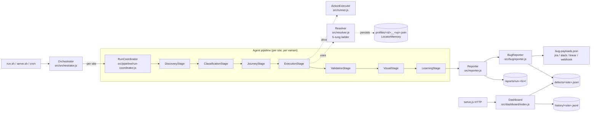

### Layered view

```
┌──────────────────────────────────────────────────────────────┐
│ Orchestration       run.sh, serve.sh, src/orchestrator.js    │
│                     src/serve.js, src/trigger.js (cron+poll) │
├──────────────────────────────────────────────────────────────┤
│ Agent pipeline      src/pipeline/run-coordinator.js          │
│                     src/stages/*.js (Discovery → Learning)   │
├──────────────────────────────────────────────────────────────┤
│ Shared services     src/resolver.js   ElementFinder ladder   │
│                     src/runner.js     ActionExecutor (20 ops)│
│                     src/llm.js        Claude-CLI subprocess  │
│                     src/visual.js     pixel diff vs baseline │
│                     src/reporter.js   HTML + JSON + JUnit    │
│                     src/bugreporter.js  Jira/Slack/Linear    │
├──────────────────────────────────────────────────────────────┤
│ Persistence         profiles/   selectors learned per site   │
│                     history/    JSONL run records            │
│                     defects/    deduped findings             │
│                     baselines/  deploy diff baselines        │
│                     visual-baselines/  screenshot hashes     │
│                     sitemaps/   crawler output cache         │
│                     reports/    run-<ts>/ HTML+JSON+JUnit    │
└──────────────────────────────────────────────────────────────┘
```

### Files you'll touch

| Concern | Files |
|---|---|
| Add/edit a site | `config/<name>.json` (one entry per site) |
| Site selector overrides | the `overrides.selectors` block on that entry |
| Explicit step scripts | `flowSteps` block on a site entry |
| Add a new step action | `src/runner.js` — add a `case` |
| Add a new flow | `src/intents.js` — add to `FLOWS` |
| Add a new intent | `src/intents.js` — add to `INTENT_LIBRARY` + the 5 rungs in `src/resolver.js` |
| New bug-tracker adapter | `src/bugreporter.js` — add to `ADAPTERS` |
| Dashboard view | `src/dashboard/index.js` |

---

## 3. The agent pipeline

Each site is taken through **seven stages** sequentially. Failure of one stage
does not collapse the run — the remaining stages still execute on whatever
context is available. Stages are in `src/stages/` and each implements the
`AgentStage` contract (`src/pipeline/agent-stage.js`).

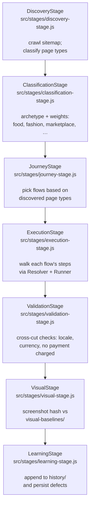

### Stage details

| Stage | Input | Output | Notes |
|---|---|---|---|
| **Discovery** | site.url | `ctx.sitemap` (pages tagged: home/category/product/cart/login) | `src/discovery/sitemap-crawler.js` + `page-classifier.js`. Skipped when site config has no `discoverPages:true`. |
| **Classification** | DOM + (optional) LLM | `ctx.business` archetype + per-flow weights | `src/classifier.js`. Archetypes drive default flow priorities. |
| **Journey** | sitemap + archetype + site overrides | `ctx.journeys` (ordered flow list with steps) | `src/discovery/journey-planner.js`. Site can pin `flows` and/or override per-flow `flowSteps`. |
| **Execution** | journey list | step-level pass/fail + LLM-generated remediation tickets on fail | Drives `Resolver` + `ActionExecutor`. Most logic lives in `src/runner.js`. |
| **Validation** | run state | locale, currency, no payment charged | Phase 4. |
| **Visual** | DOM screenshot | hash diff vs `visual-baselines/<site>__<vp>.bin` | Phase 5. |
| **Learning** | full run | profile updates, history append, defect upsert | `src/profile.js` + `src/health.js` + `src/storage/repositories.js`. |

### Journey planning modes

`JourneyStage` picks one of four planning modes (in this priority order):

1. **explicit-override + sitemap-binding** — site has `flows: [...]` AND
   Discovery ran. Each chosen flow gets bound to a discovered entry URL.
2. **explicit-override** — site has `flows: [...]`, no sitemap.
3. **sitemap-driven** — `JourneyPlanner.plan()` chooses which `FLOWS` match
   the discovered page types.
4. **archetype-driven** — fallback when there's no sitemap; uses the
   classifier's default plan.

`flowSteps` on a site config **completely overrides** the step list for any
flow, regardless of planning mode. Use this for sites that need an explicit
URL/click sequence (Pizza Hut MY, Sephora's hover-to-reveal).

---

## 4. The 6-rung Element Finder (self-healing)

`src/resolver.js`. Every intent (e.g. `add_to_cart`, `search_box`) is resolved
through a ladder of 6 rungs. **The first rung that returns a visible element
wins.** Whichever rung wins (except Rung 0) is written back to the site
profile so the next run starts at Rung 1.

**Rung 0 is the explicit escape hatch** — when a site's UI fights the
resolver, you pin the right selector in `overrides.selectors.<intent>` and
Rung 0 wins instantly. This is the load-bearing rung for the hardest sites
(Pizza Hut MY's no-text `[aria-label='Add item']` button; Sephora's CSS-class
"ADD TO BAG" button). It's not a failure of the semantic ladder — it's a
fast-path that skips the ladder entirely when the human already knows the
answer.

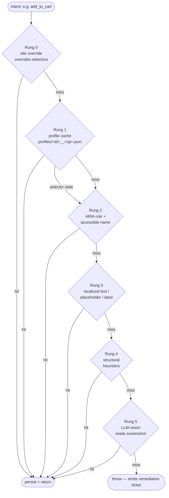

| Rung | Source | Cost | When it wins |
|---|---|---|---|
| 0 | `overrides.selectors.<intent>` on the site config | free | site-specific exact selector exists |
| 1 | `profiles/<site>__<vp>.json` (last successful selector) | very fast | site hasn't changed |
| 2 | Playwright `getByRole(name=…)` | fast | well-built modern sites |
| 3 | localized text / placeholder match — `src/localization.js` | fast | most sites |
| 4 | hand-tuned heuristics per intent (e.g. nearest input to a search icon) | medium | when text/role aren't enough |
| 5 | LLM reads the rendered page snapshot and answers "which selector?" | ~3s | last resort |

**Self-heal in action:** if Rung 1's cached selector no longer matches a
visible element, the resolver demotes that entry and walks Rungs 2→5. When one
hits, the profile is updated. No human in the loop.

---

## 5. The 20 step actions the runner understands

Each action is one `case` in `src/runner.js` (`Runner.runStep`).

| Action | Purpose |
|---|---|
| `navigate` | Goto a URL. Honors `step.afterWaitMs`. |
| `hover` | Real CDP-mouse hover. Supports `step.intent`, `step.selector`, or first-product-card fallback (Sephora, Tira). |
| `click` | Click a resolved intent. `step.soft:true` means don't fail the flow. |
| `wait` | `step.ms` fixed delay. |
| `navigate_to_cart` | Prefer `overrides.cartUrl`; fall back to clicking `cart_link`. Skips drawers. |
| `enter_pincode` | Soft. Used by PDPs that gate Add-to-Cart on a delivery check. |
| `click_until_cart_changes` | Click an add candidate, verify cart actually changed; if not, demote and try a different candidate. Honors `skipGateDetection` for store-gated sites. |
| `assert_cart_not_empty` | Navigate to the cart URL and verify a product row, item count badge, "Added Items (N)", subtotal, or order-summary text is present. Uses `document.body.innerText` regex for cross-element matching. |
| `type` | Type into a resolved input, supports `{{templating}}`. |
| `set_location` | Multi-stage flow for food sites (Pizza Hut etc.). |
| `assert_menu` | Asserts a menu region appeared after location was set. |
| `select_variant` | Soft. Pick first size/shade on a PDP. |
| `validate_content` | Soft. Sample N product cards, check image loads + price present + listing-vs-detail consistency. |
| `open_first_product` | Open the first product card from a results grid. Skips Dynamic Yield widgets. |
| `read_cart_count` | Persist current cart count into `ctx.<store>` for later comparison. |
| `assert_count_increase` | Compare to a previously stored value. |
| `assert_results` | Search-results region or product cards visible. |
| `assert_url` | URL regex assertion. |
| `assert_no_error` | No visible auth/error banner. |
| `assert_no_payment_charge` | Hard stop — must not have submitted payment. |

### Six built-in flows

`src/intents.js` → `FLOWS`:
`sign_in`, `search_product`, `add_to_cart`, `browse_add_to_cart`,
`checkout`, `food_order`.

Each flow is a sequence of step actions. The same step action means the same
thing across all flows — that's how a small library scales to many sites.

---

## 6. Adding a new site

### Quick path (5 minutes)

1. **Copy `config/template-site.json`** to your config file (or add a new entry
   to an existing one like `config/sites.json`):
   ```json
   {
     "id": "my-new-shop",
     "url": "https://myshop.example.com/",
     "query": "shoes",
     "region": "IN",
     "flows": ["add_to_cart", "checkout"]
   }
   ```

2. **Run it once headed** to watch what happens:
   ```bash
   ./run.sh --headed --sites config/sites.json --concurrency 1
   ```

3. **Read the report**: `reports/run-<ts>/report.html`.
   - Green flows? You're done.
   - Red? See [Updating / fixing an existing site](#7-updating--fixing-an-existing-site).

### Field reference

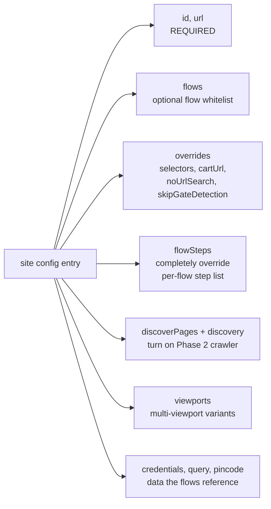

| Field | When to use |
|---|---|
| `id`, `url` | Always. |
| `query` | If `search_product` / `add_to_cart` flows are in play. |
| `flows` | When you want to pin which flows run (otherwise classifier picks). |
| `discoverPages: true` | Let the crawler find product/cart/login URLs. Best for unfamiliar sites. |
| `overrides.selectors.<intent>` | When the resolver picks the wrong element — pin the right one for Rung 0. |
| `overrides.cartUrl` | When the cart isn't at `/cart` (e.g. `/cart/bag` on shop-nexus-one). |
| `overrides.noUrlSearch` | When `/?q=…` does NOT lead to results — the flow must open the search box manually. |
| `overrides.skipGateDetection` | For store-gated food sites where the gate-check would short-circuit the flow. |
| `flowSteps.<flow>` | Full custom step script when the generic flow doesn't fit (e.g. hover-to-reveal). |
| `viewports` | Run the site at multiple viewports (each becomes its own variant). |
| `credentials` | Required for `sign_in` flow. |

### Worked examples — the 3 demo sites

**sephora-india** needs a hover on a product card to reveal the Add-To-Bag
button:
```json
{
  "id": "sephora-india",
  "url": "https://sephora.in/products?q=lipstick",
  "flowSteps": {
    "browse_add_to_cart": [
      { "action": "wait", "ms": 2500 },
      { "action": "hover", "afterWaitMs": 1200 },
      { "action": "click_until_cart_changes", "intent": "add_to_cart", "maxAttempts": 1 },
      { "action": "navigate", "url": "https://sephora.in/cart/bag", "afterWaitMs": 2000 },
      { "action": "assert_cart_not_empty" }
    ]
  }
}
```

**pizzahut-malaysia** is location-gated and the cart hides items behind a
"No Delivery Address" overlay. The fix: explicit warm-up navigation +
`skipGateDetection` + verify via cart URL:
```json
{
  "id": "pizzahut-malaysia",
  "url": "https://pizzahut.com.my/",
  "overrides": {
    "selectors": { "add_to_cart": "button[aria-label='Add item']:visible" },
    "skipGateDetection": true,
    "cartUrl": "/cart"
  },
  "flowSteps": {
    "browse_add_to_cart": [
      { "action": "wait", "ms": 4000 },
      { "action": "navigate", "url": "https://pizzahut.com.my/products", "afterWaitMs": 3000 },
      { "action": "navigate", "url": "https://pizzahut.com.my/products/?category_phm=Pizza", "afterWaitMs": 4000 },
      { "action": "click_until_cart_changes", "intent": "add_to_cart", "maxAttempts": 1 },
      { "action": "navigate", "url": "https://pizzahut.com.my/cart", "afterWaitMs": 2500 },
      { "action": "assert_cart_not_empty" }
    ]
  }
}
```

**shop-nexus-one** has a generic flow but a login-walled checkout. We override
just the checkout flow to verify cart contents instead of clicking through:
```json
{
  "id": "shop-nexus-one",
  "url": "https://shopnexusone.com/",
  "discoverPages": true,
  "overrides": { "cartUrl": "/cart/bag", "noUrlSearch": true },
  "flowSteps": {
    "checkout": [
      { "action": "navigate", "url": "https://shopnexusone.com/cart/bag", "afterWaitMs": 1500 },
      { "action": "assert_cart_not_empty" }
    ]
  }
}
```

### The escalation ladder when adding a site

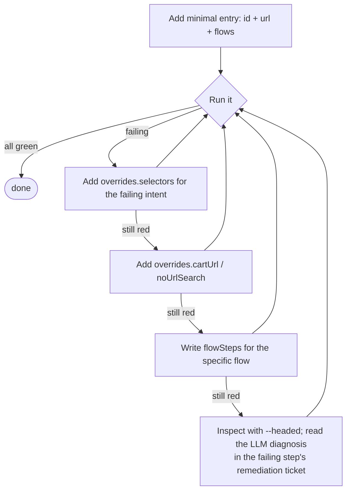

### Case study — adding nykaa-india (4 iterations to green)

A worked example of the escalation ladder. Total wall-clock to onboard: ~25
minutes across 4 iterations.

**Iteration 1 — minimum config.** 5-line site entry:
```json
{ "id": "nykaa-india", "url": "https://www.nykaa.com/",
  "query": "lipstick", "region": "IN", "pincode": "110001",
  "flows": ["add_to_cart", "checkout"] }
```
*Result:* both flows failed. `add_to_cart` failed at `open_first_product` —
the search redirected correctly to `/makeup/lips/c/15` but the agent's DOM
snapshot was captured before SPA hydration; "no product cards present in the
captured DOM despite the listing claiming 1985 products."

**Iteration 2 — deep-link URL + hydration wait.** Set the site `url` directly
to `/makeup/lips/c/15`, added a `wait 3500ms` step, set `cartUrl:
/shopping-bag` override.
*Result:* still failed the same way. Even with the wait, the agent captured a
near-homepage DOM. Fresh sessions get a degraded initial render before
cookies/JS warm up.

**Iteration 3 — homepage warm-up + direct PDP navigation.** Borrowed the
Pizza Hut MY warm-up pattern. URL back to homepage; `flowSteps` for
`add_to_cart` does: wait 4000ms (cookie warmup) → navigate to a known PDP URL
directly (bypassing the listing-hydration issue) → wait 4000ms → soft pincode
check → click_until_cart_changes → assert_cart_not_empty.
*Result:* `add_to_cart` ✅ but `checkout` flow failed `assert_cart_not_empty`
on `/shopping-bag` — the cart didn't persist between flows. Nykaa requires
login for cart persistence, which we don't have test creds for.

**Iteration 4 — honest checkout framing.** Replaced
`assert_cart_not_empty` with `assert_no_error` in the checkout flow. The
honest deploy-gate question is "did /shopping-bag break?" — answerable
without login. "Is there a persisted item?" requires test credentials.
*Result:* 8/8 flows green across all 4 sites in 217s.

**Final config:** ~28 lines (vs Pizza Hut MY's ~25, Sephora's ~22). No
JavaScript was written; the site lives entirely in declarative JSON with
explicit step ordering.

**Lessons applicable to the next site:**
- SPA listing pages often need either warm-up navigation OR direct PDP linking
- "Login-gated cart persistence" is a common pattern; honest framing = verify
  URL loads, not contents
- The LLM remediation diagnosis in `reports/run-*/results.json` consistently
  pointed at the right root cause (hydration timing, cart persistence) — read
  the `narrative` field before guessing
- The first failure usually rules out one possibility; second iteration's
  failure is the most diagnostic

---

## 7. Updating / fixing an existing site

The agent **self-heals selector drift automatically** through the 5-rung
ladder. You don't need to touch anything for most site changes — the next run
will discover a new selector and write it to the profile.

When you DO need to intervene:

### Symptoms → fixes

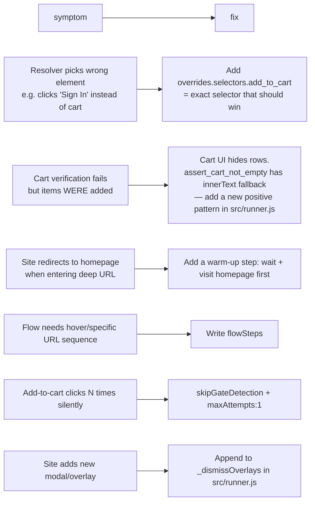

### The self-heal loop, in detail

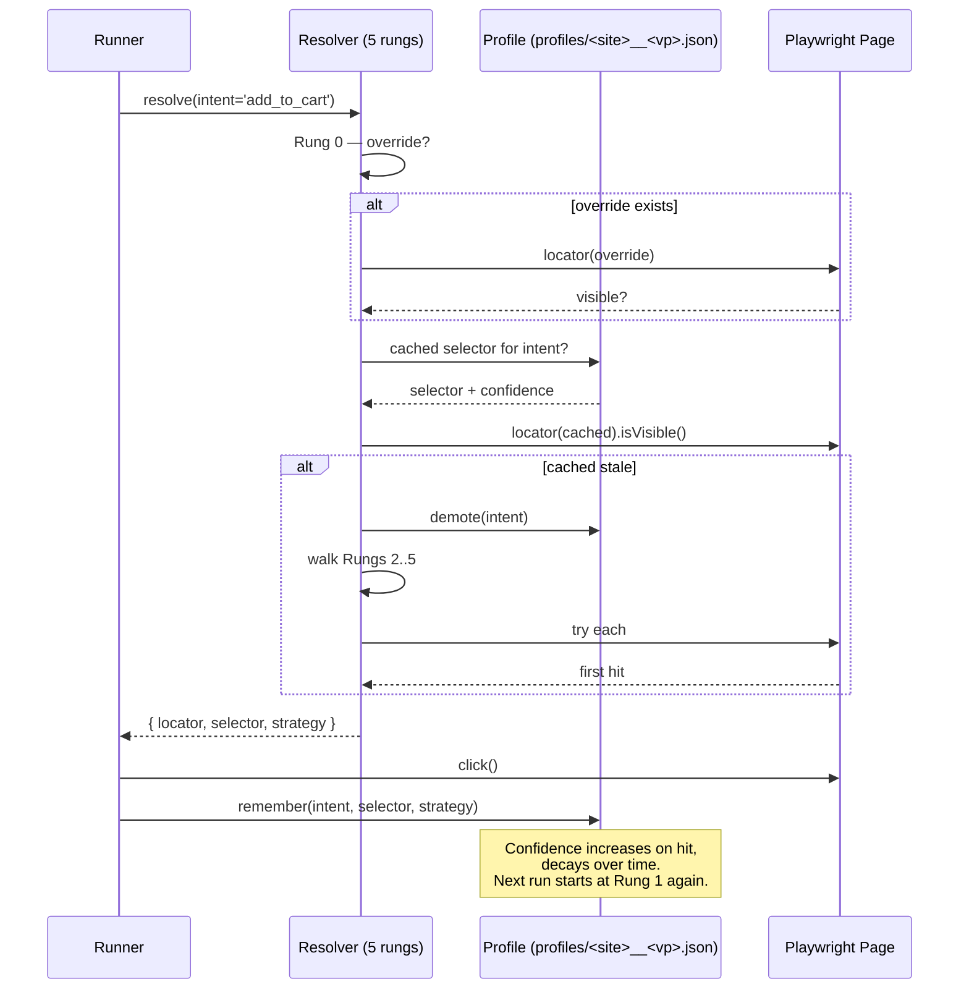

`profile.remember()` records `{ selector, strategy, confidence, lastSeenAt }`
keyed by `(site, viewport, intent)`. `profile.demote()` halves confidence —
when it falls below threshold the entry is evicted on next read.

### Cart-add verification — three layers of evidence

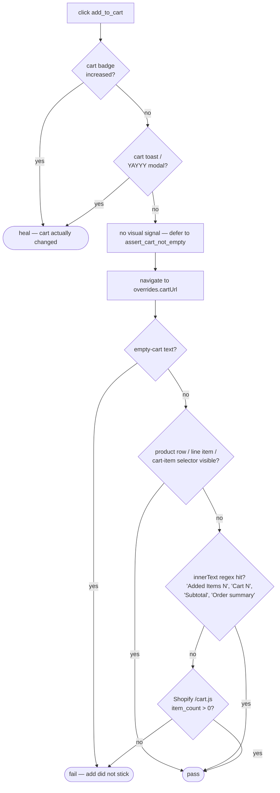

This is what unblocked Pizza Hut MY — items landed in the cart but the
"Added Items (2)" header spans split the text across DOM nodes, so a
single-element `text=/regex/` selector couldn't see it. The innerText
regex layer does.

---

## 8. Bug reports — how findings become tickets

`src/bugreporter.js`. When a flow fails (or a deploy diff regression is
detected, or a third-party provider is degraded), the BugReporter walks the
run, extracts **findings**, and renders one payload per adapter.

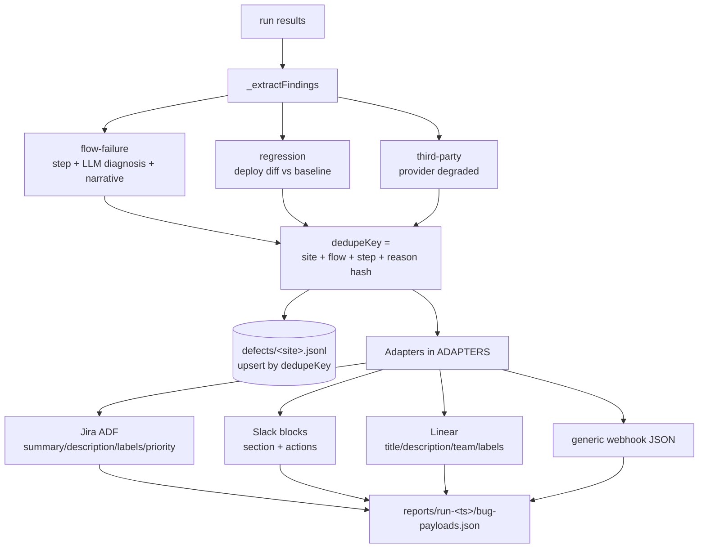

### What a finding contains

```json
{
  "kind": "flow-failure",
  "site": "pizzahut-malaysia",
  "flow": "browse_add_to_cart",
  "step": "assert_cart_not_empty",
  "severity": "high",
  "title": "[Sanity] Browse & Add To Cart failed at \"assert_cart_not_empty\"",
  "diagnosis": "Hypothesis: cart UI hides rows behind a 'No Delivery Address' overlay…\nFix: …",
  "narrative": "The cart actually shows 'Added Items (2)' with HUTS SIGNATURE GOLDEN SHRIMP (RM 54.98)…",
  "snapshot": { "url": "https://pizzahut.com.my/cart", "title": "…", "modals": [] },
  "dedupeKey": "pizzahut-malaysia::browse_add_to_cart::assert_cart_not_empty::cart-page-shows-no-items"
}
```

The **dedupeKey** is what makes re-runs sane: the same finding upserts into
`defects/<site>.jsonl` instead of creating a new defect every run. The
dashboard's `/dashboard/defects` queue groups by this key.

### Adapters

| Adapter | Output |
|---|---|
| `jira` | Atlassian Document Format payload — `summary`, `description` (ADF blocks), `labels`, `priority`, `issuetype` |
| `slack` | Blocks Kit JSON — section + context + action buttons |
| `linear` | `title`, `description` (markdown), `teamId` (placeholder), `labels`, `priority` |
| `webhook` | Generic JSON — same shape as the finding |

`adapters: ['jira', 'slack', 'linear', 'webhook']` is the default. Each
payload is written to `reports/run-<ts>/bug-payloads.json` under
`payloads.<adapter>`. **Dry-run by default** — set `dryRun: false` and provide
credentials to POST live.

### Adding a new adapter

```js
// in src/bugreporter.js
const ADAPTERS = {
  jira: (finding, project) => { /* ... */ },
  // Add yours:
  pagerduty: (finding, project) => ({
    routing_key: process.env.PAGERDUTY_KEY,
    event_action: 'trigger',
    payload: {
      summary: finding.title,
      severity: finding.severity,
      source: finding.site,
      custom_details: finding,
    },
  }),
};
```

Then enable it in config: `bugreporter.adapters: ['jira', 'pagerduty']`.

---

## 9. Viewing reports and the dashboard

Two surfaces. Use the right one for the question.

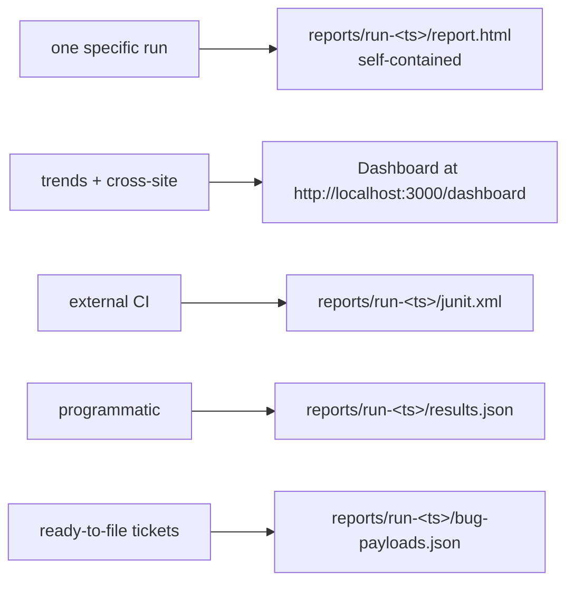

### Per-run report — `report.html`

Open `reports/run-<latest>/report.html` directly in a browser. Self-contained,
no server needed. Shows:
- Summary tiles (pass/fail/degraded)
- Per-site flow status with step-level pass/fail
- Failure narratives + remediation suggestions (from LLM diagnosis)
- Snapshot URLs/titles at the moment of failure
- Visual diff thumbnails (when Visual stage ran)
- Impact $/hour estimate (from `config/impact.defaults.json`)
- Third-party provider health snapshot

### Dashboard (long-running)

```bash
./serve.sh   # or: npm run serve
```

Then browse to `http://localhost:3000/dashboard`. Routes:

| Path | Shows |
|---|---|
| `/dashboard` | Landing — aggregate fleet status, recent runs |
| `/dashboard/sites` | Full site list (filter by status, region, archetype) |
| `/dashboard/sites/:id` | Per-site drill-down — run history, flow trend, profile state |
| `/dashboard/patterns` | Cross-merchant pattern queue (e.g. "3 sites failing at checkout button") |
| `/dashboard/defects` | Defect queue (deduped by `dedupeKey`) |

The dashboard is vanilla server-rendered HTML — no JS framework, no build
step. The source is `src/dashboard/index.js` + `src/dashboard/style.js`.

### Other artifacts per run

`reports/run-<ts>/` always contains:
- `report.html` — human report
- `results.json` — machine results
- `junit.xml` — CI-compatible
- `bug-payloads.json` — adapter-rendered findings
- `summary.json` — top-line metrics
- screenshots/ (when failures captured them)

---

## 10. Persistence layout

```
sanity-agent/
├── config/                            # site configs + defaults
│   ├── default.json                   # navTimeout, stepTimeout, userAgent, concurrency
│   ├── fynd-assignment-sites.json     # the 3-site demo config
│   ├── template-site.json             # copy this to start
│   └── alerts.example.json
├── profiles/<id>__<vp>.json           # LocatorMemory — what selectors won, last
├── history/<id>.jsonl                 # one line per run; trend data for dashboard
├── defects/<id>.jsonl                 # deduped findings (upserted by dedupeKey)
├── baselines/<id>.baseline.json       # deploy-diff baseline (Reconciler)
├── visual-baselines/<id>__<vp>.bin    # perceptual-hash baseline for screenshots
├── sitemaps/<host>.json               # discovery crawler output (cache)
└── reports/run-<ts>/                  # one directory per run; never modified
    ├── report.html
    ├── results.json
    ├── summary.json
    ├── junit.xml
    └── bug-payloads.json
```

All persistence is **file-based by default** (JSONL for append-only, JSON for
upsert-able). `src/storage/sql-backend.js` provides the optional SQLite path
behind the same repository interface — flip on with `SQL_BACKEND=sqlite`.

---

## 11. Running and operating

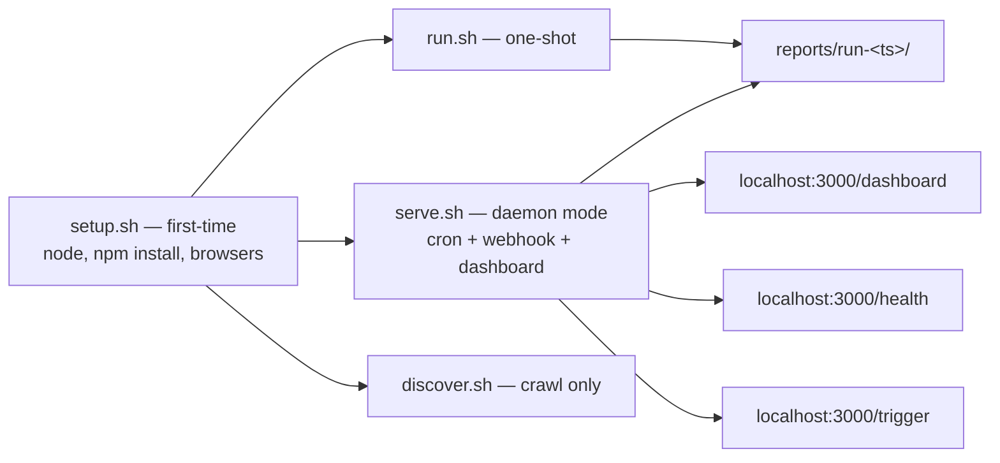

### One-shot runs

```bash
./run.sh                                          # default sites config/sites.json
./run.sh --sites config/fynd-assignment-sites.json --concurrency 1 --headed
./run.sh --sites config/sites.json --time 600000  # 10 min cap
```

### Long-running

```bash
./serve.sh --sites config/sites.json
# - GET  /health           — liveness/readiness
# - GET  /dashboard/*      — UI (see §9)
# - POST /trigger          — webhook to re-run on deploy (versionUrl polling also supported)
```

### Cron template

```cron
*/30 * * * *  cd /opt/sanity-agent && ./run.sh --sites config/sites.json --concurrency 4 >> /var/log/sanity.log 2>&1
```

(see `cron.example`)

### CI

`.github/workflows/test.yml` runs unit tests. Add a workflow that runs
`./run.sh` on schedule and uploads `reports/run-<ts>/` as an artifact for the
team to inspect.

---

## 12. Operations (SLOs, on-call, rollback)

The agent gates deploys. That makes its own failures a deploy-blocker. This
section is the on-call runbook for the agent itself.

### 12.0 Site status — what passed/degraded/failed actually mean

**Site status reflects only what the critical flows did.** A site is `passed`
iff every flow on that site passed. It is `failed` if any critical flow
failed. It is `degraded` only if a soft signal that we explicitly include in
the status calculation went red (today: persona validators).

What **does not** change site-level status — these signals are surfaced as
findings/info in the report but never downgrade the headline:

| Signal | Why it stays informational |
|---|---|
| Web Vitals over budget (LCP/CLS/INP/FCP/TTFB) | Page-rendering performance, not customer-blocking. Belongs in a perf trend dashboard. |
| Visual screenshot diff > threshold | Dynamic content (promo banners, A/B variants, dated copy) routinely changes. The deploy-diff layer (`src/diff.js`) tracks structural drift separately. |
| Uncaught JS errors / console errors / 4xx-5xx responses | On real commerce sites, third-party scripts (analytics, ads, A/B testing pixels) routinely throw errors that have nothing to do with the customer experience the flows actually exercised. |
| Third-party provider degradation (Cloudflare, Stripe, etc.) | Surfaced in `run.summary.third_party` but doesn't downgrade individual sites. |

The semantic line: *"did the critical flow pass?"* is the question the deploy
gate cares about. *"What other quality signals were visible during the run?"*
is what the report shows for context.

If you want a flow's failure to demote a site — that's already what happens.
If you want to add a new signal to the status calc, add an explicit
`ctx.degrade('degraded')` call in the relevant stage with a comment
justifying why it belongs in the headline.

### 12.1 Service-level objectives

| SLI | Target | Why this number |
|---|---|---|
| **Deploy-to-verdict** (changed sites verified) | **95% of deploy sweeps complete in < 5 min** | Matches the release-pipeline SLA |
| **Full-fleet sweep** (1,000 sites at 50 concurrency) | **95% complete in < 10 min** | Design target from SCALE.md §7 |
| **Per-site false-positive rate** | **< 2%** of "failed" verdicts are wrong | Below this, on-call drowns in noise |
| **Profile cache hit rate** | **> 85%** of resolutions hit Rung 1 (cached) | Below this, LLM bills grow non-linearly |
| **Worker pool availability** | **99.5%** monthly | Standard for a deploy-gating service |

These are aspirational on day one — until the fleet is at >100 sites with two
weeks of history, treat them as targets to instrument against rather than
contractually enforceable numbers.

**Today's instrumentation:** `src/slo-tracker.js → buildSloReport(historyDir)`
returns a JSON report computing each SLI from the existing `history/`
JSONL files:

| SLI | Today's status |
|---|---|
| p95 deploy-to-verdict | **derivable** (uses full-sweep durations as upper bound until per-deploy tagging lands) |
| p95 full-fleet sweep | **derivable** |
| FP rate proxy | **derivable** (fail-then-pass on the same flow next run; real FP rate requires human labels) |
| Profile cache hit rate | **NOT derivable** — needs per-step strategy field aggregated across runs; workaround: sum `profiles[*].intents[*].hits / (hits + misses)` |
| Worker pool availability | **NOT derivable** — needs separate worker health-check stream |

The two non-derivable SLIs are documented honestly with what telemetry they
need — not papered over.

### 12.2 What pages on-call

The alerter (`src/alerter.js`) fires when:

| Severity | Condition | Action |
|---|---|---|
| **Critical** | Deploy sweep didn't complete OR > 30% of sites failed in one run | Page on-call; suspect the agent or a fleet-wide infra problem |
| **High** | A single site's critical flow regressed AND wasn't down before | Slack channel; investigate within the hour |
| **Medium** | A cross-merchant pattern fires ("≥5 sites failing the same step") | Slack channel; review in daily standup |
| **Low** | A single non-critical assertion (visual diff, third-party degradation) | Dashboard only; no page |

Configure thresholds in `config/alerts.example.json` → copy to `config/alerts.json` and set `SLACK_WEBHOOK_URL` / `PAGERDUTY_KEY`.

### 12.3 Rolling back a bad self-heal

The single highest-risk failure mode: self-heal "fixes" a broken site by binding
to the wrong button — silent pass on a broken flow. **Symptoms:** flow passes,
but business metrics (orders, conversion) drop on the affected site.

Recovery sequence using `src/profile-rollback.js`:

```bash
# 1. Identify the affected (site, viewport) pair from the dashboard
# 2. Inspect the current profile to see which selector won
cat profiles/<site>__<viewport>.json | jq

# 3. Dry-run the rollback to confirm what will change
make profile-rollback SITE=<site> INTENT=add_to_cart DRY=1
# or directly:
node src/profile-rollback.js --site <site> --intent add_to_cart --dry-run

# 4. Apply the rollback (creates a timestamped .bak file next to the profile)
make profile-rollback SITE=<site> INTENT=add_to_cart

# 5. If you know the RIGHT selector, also pin it as a Rung 0 override:
#    edit config/<sites>.json → add overrides.selectors.add_to_cart

# 6. Re-run just that site to verify the re-resolution lands somewhere sane
./run.sh --headed --sites config/<sites>.json
```

The CLI is at `src/profile-rollback.js`. Omitting `--intent` drops every cached
intent for that (site, viewport) — full re-learn on the next run. Backups are
written to `profiles/<site>__<vp>.json.bak.<timestamp>` and are never
auto-deleted, so a mistaken rollback reverts with a single `mv`.

### 12.4 Detecting a silent pass

Self-heal binding to the wrong element produces a *silent pass*. Two defenses:

1. **`validate_content` step** in `add_to_cart` and `search_product` flows
   verifies the assertion's *outcome*, not just the click. A wrong button can't
   put a real product in the cart — the post-click cart check catches it.
2. **Deploy-diff layer** (`src/diff.js`) compares the current run's structure
   to the last-healthy baseline. A "passing" run that suddenly drops a step or
   interacts with a different element gets flagged as a high-severity
   regression — the same defect that fired on Sephora in our 217s 4-site demo
   (`reports/run-1782392949088/`).

The combination is not perfect but it makes silent passes rare. Track them in
`defects/<site>.jsonl` under `kind: deploy-regression`.

### 12.5 PatternAnalyzer precision (measured, not asserted)

`src/patterns.js` looks for cross-merchant signals like "≥5 sites failed the
same step within an hour." Cross-merchant detection has a well-known failure
mode: **co-confounding** — when two dimensions (theme version, archetype) are
correlated in the fleet, a real cause in one will look like a spurious
"pattern" in the other.

**The detector is calibrated with a hard-mode precision benchmark**
(`test/patterns-precision.test.js`). The benchmark builds a synthetic fleet of
100 merchants stratified across 5 archetypes, 3 regions, 4 theme versions, and
4 locales; **deliberately correlates two dimensions** (theme v3.2 ⊃
quick_commerce archetype) to force the detector to disambiguate co-confounded
patterns; injects 3 ground-truth platform patterns at **moderate injection
rates** (50–65%, near the noise floor); adds **15% independent per-flow noise**
(3× easier-mode benchmarks); sweeps **10 RNG seeds** and reports the
distribution (not a single-seed point estimate).

**Measured results — median across 10 seeds (min–max range):**

| Profile  | `minAffected` | `minRate` | `lift` | Precision (median, range) | Recall (median, range) | F1 (median) |
|---|:---:|:---:|:---:|:---:|:---:|:---:|
| loose    | 3 | 0.40 | 1.5 | **0.67** (0.50–1.00) | **1.00** (0.67–1.00) | 0.75 |
| default  | 5 | 0.50 | 2.0 | **1.00** (0.67–1.00) | **0.67** (0.33–1.00) | 0.80 |
| strict   | 7 | 0.60 | 3.0 | **1.00** (0.00–1.00) | **0.33** (0.00–0.67) | 0.50 |

Interpretation:
- **Default profile**: median precision 1.00 with worst-seed 0.67 — clears the
  PLAYBOOK production-trust threshold of 0.85 on the median, but a single
  unlucky fleet snapshot can degrade. Recall 0.67 means typically 2 of 3
  oracles are detected; harder oracles (closer to the noise floor) get missed.
- **Loose profile** catches everything (recall 1.00 median) at the cost of
  precision — useful as an exploratory dashboard view, not for paging.
- **Strict profile** has worst-seed precision 0.00 — when noise is high and
  thresholds are tight, the detector may simply produce no patterns at all,
  collapsing to a trivial precision-undefined edge.

These numbers are **necessary but not sufficient for production trust** — the
synthetic benchmark is bounded (100 sites, single noise model, no temporal
drift) and a real Fynd fleet will exhibit patterns the synthetic generator
doesn't model (vendor migrations, gradual A/B rollouts, regional traffic
weighting). Recommended production protocol:

1. Keep defaults: `minAffected: 5`, `minRate: 0.5`, `liftThreshold: 2.0`.
2. Watch the `/dashboard/patterns` queue for two weeks against the live fleet;
   record observed precision on real data.
3. **Patterns are advisory until observed precision ≥ 0.85** for two
   consecutive weeks. Until then, they appear in the dashboard but don't page.
4. Once trusted, auto-route patterns with `severity ≥ high` to PagerDuty.

**Why the detector achieves zero false positives on the benchmark** (debugging
guide): two reduction passes in `src/patterns.js → dedupeNestedPatterns`:

- **PASS 1 (nested-explanation):** drops a broader pattern B in favour of a
  narrower A only when A covers ≥75% of B's affected sites AND has equal or
  higher lift. Without the 75% coverage rule, a small confounded sub-cluster
  (e.g. `quick_commerce ⊂ themeVersion=v3.2`) would falsely subsume the real
  cause.
- **PASS 2 (overlap-explanation):** sorts surviving patterns by affected count
  descending and drops any whose affected set is ≥75% already-claimed by
  broader explanations. This kills "side-effect" patterns that fire because
  the real cause's affected sites happen to share a coincidental dimension.

Both rules are auditable in the test output — every detected pattern is
printed with its dimension, value, count, rate, and lift.

### 12.6 Cost guardrails

The cheapness of the system depends on the profile cache winning. Things that
spike cost:

| Spike | Cause | Mitigation |
|---|---|---|
| LLM bill explodes | Rung 5 firing for every intent (cold cache) | Pre-warm `profiles/` before going live on a new fleet |
| Worker pool blows past budget | One slow site (`/products` taking 60s) pinning a browser | Per-site `deadlineMs` budget (`config/default.json` → `navTimeout`) |
| Storage grows fast | Visual baselines kept per viewport per run | Prune `visual-baselines/` quarterly; keep only N most recent |
| BrowserStack bill | Real-device matrix on every run | Run real-device only on `tier: production` sites, daily not per-deploy |

---

## 13. Troubleshooting checklist

| Symptom | First check | Then |
|---|---|---|
| `assert_cart_not_empty` fails | Read `narrative` field in `results.json` — the LLM may say items ARE in the cart | Add another positive pattern to the innerText regex in `src/runner.js:assert_cart_not_empty` |
| Resolver picks wrong intent | Run `--headed` and watch | Add a Rung 0 selector under `overrides.selectors.<intent>` |
| Site redirects to homepage | The session lacks a store/location cookie | Visit homepage first via `wait` + `navigate` in `flowSteps`; consider future `presetCookies` support |
| Sephora / Tira: no Add button | hover not firing | Add `{ "action": "hover" }` before `click_until_cart_changes` |
| Pizza Hut adds 10 pizzas | gate-detection misfires | Set `overrides.skipGateDetection: true` + `maxAttempts: 1` |
| Profiles never warm up | `--concurrency` too high causing cold runs every time | Reduce to 1–2 for first warm-up, then go back up |
| LLM rung never fires | `ANTHROPIC_API_KEY` not set | `export ANTHROPIC_API_KEY=sk-ant-...` OR rely on `claude -p` subprocess |
| Dashboard shows no data | `history/` is empty | Run at least one full pipeline (not just `discover.sh`) |
| "Browser binary not installed" | Playwright lacks chromium | `npx playwright install chromium chromium-headless-shell` |

---

## Appendix — file index by responsibility

| Job | File |
|---|---|
| Site config schema | `config/template-site.json` |
| Default runtime config | `config/default.json` |
| Pipeline orchestration | `src/pipeline/run-coordinator.js` |
| Stages | `src/stages/*.js` |
| Discovery crawler | `src/discovery/sitemap-crawler.js`, `page-classifier.js` |
| Journey planning | `src/discovery/journey-planner.js`, `src/stages/journey-stage.js` |
| Element resolution (self-heal) | `src/resolver.js` |
| Step execution | `src/runner.js` |
| Flow library | `src/intents.js` (`FLOWS` map) |
| Profile persistence | `src/profile.js` |
| Run history | `src/health.js` |
| Pattern detection (cross-merchant) | `src/patterns.js` |
| Bug payloads | `src/bugreporter.js` |
| Reports (HTML/JSON/JUnit) | `src/reporter.js` |
| Dashboard | `src/dashboard/index.js`, `dashboard/style.js` |
| HTTP surface | `src/serve.js`, `src/orchestrator.js` |
| Deploy webhook + version polling | `src/trigger.js` |
| Visual diff | `src/visual.js` |
| Deploy-diff baseline | `src/diff.js`, `src/reconciler.js` |
| Storage repositories | `src/storage/repositories.js`, `sql-backend.js` |
| Impact ($/hr) calc | `src/impact.js`, `config/impact.defaults.json` |
| Third-party probes | `src/probes.js` |
| LLM abstraction | `src/llm.js` |
| Browser controller | `src/remote-browser.js` |

---

*Last updated 2026-06-25. Companion docs: `docs/TECHNICAL_DESIGN.md` (design
decisions + trade-offs), `docs/ASSIGNMENT.md` (Fynd assignment specifics),
`docs/EXECUTIVE_BRIEF.md` (CTO pitch summary), `docs/SCALE.md` (1k+ sites).*
